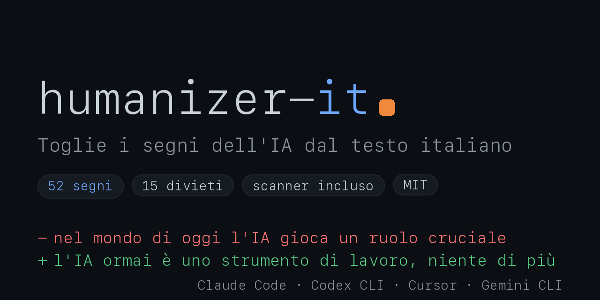

# humanizer-it: umanizza il testo IA italiano per Claude Code, Cursor, Codex e altri agenti

<p align="center">
  <a href="https://ilyautov.github.io/humanizer-it/"></a>
</p>

🇬🇧 **English** · 🇮🇹 [Italiano](README.it.md)

Claude Code / Cowork plugin. Kills AI smell in **Italian** text. The English [humanizer](https://github.com/blader/humanizer) won't help here, and neither will [humanizer-ru](https://github.com/ilyautov/humanizer-ru). Italian AI markers are their own beast: the **«IA-taliano»** that Treccani officially catalogued in 2023 — English-syntax calques (*impronte algoritmiche dell'inglese*, A.-M. De Cesare), nominal-style burocratese, the missing *intercalari* (allora, insomma, magari) and ci/ne clitics that make Italian sound alive, and the flattened *antifrasi* irony.

[](LICENSE)
[](CHANGELOG.md)

> Italian fork of the battle-tested [humanizer-ru](https://github.com/ilyautov/humanizer-ru). Same language-independent core (perplexity/burstiness, modes, contrastive subtraction, fact-lock, quad-pass audit); the marker content is rebuilt for Italian and grounded in the research in [CORPUS-MARKERS-IT / CORPUS-DESIGN-IT](https://github.com/ilyautov/humanizer-it).

## What you get

A catalog of 52 patterns across 12 categories: burocratese / nominal style (-zione, -mento), English calques and translationese, the copula «è» overuse, pro-drop violations (redundant io/tu/lui) and under-used ci/ne clitics, falsi amici (realizzare, eventualmente, attualmente), emotional sterility, persuasion tricks, information rhythm, plus the 2025-2026 stylistic fingerprints (jagged-meditation single-word sentences, pseudo-Socratic Q&A chains, decorative emoji per list item, pseudo-therapeutic register). **15 hard-banned constructions** that scream "an LLM wrote this", led by the negative parallelism «non solo… ma anche» and the em-dash (in native Italian it's rarer than in English — so *more* suspicious, and detectors count its frequency).

It also does what a detector can't: it **brings back living Italian** — intercalari, ci/ne clitics in idioms, left dislocation («Il caffè lo prendo dopo»), litote and antifrasi irony, real idioms. That's the differentiator versus a detector-only tool like aipatterndetector.it.

A research-backed section explains how detectors actually work (perplexity, burstiness, native-Italian morphosyntax) with the Italian benchmark line: **DeSegMa-IT @ EVALITA 2026** (UmBERTo ~0.9458) and the key insight that native-from-scratch models (Minerva-7B) are caught at only ~50% recall while English-first models leak at >90% — so the humanizer pushes text toward the native-Italian centroid and silences the anglo-calques.

## Deterministic scanner included — zero dependencies

The skill ships with `scripts/scan.py`, the machine half of Audit mode. It counts what an LLM eyeballs: hard bans, marker categories, sentence rhythm (burstiness), and Italian morphosyntax (nominalization density, pro-drop, ci/ne clitics). Unlike the RU version it needs **no spaCy or pymorphy** — plain Python stdlib, so it runs anywhere:

```bash
python3 skills/humanizer-it/scripts/scan.py file.txt
echo "il tuo testo" | python3 skills/humanizer-it/scripts/scan.py -
```

It prints a `CLEANLINESS: N/100` score and a band (clean / edit / rewrite). See [`eval/`](eval/) for the harness and [eval/RESULTS.md](eval/RESULTS.md) for before/after deltas on a stratified corpus (7/7 AI texts cleaned to zero hard bans; 3/3 human Wikipedia controls pass clean).

## Install

### 1. Claude.ai (Web UI)

1. Download the repo as a ZIP: `https://github.com/ilyautov/humanizer-it/archive/refs/heads/main.zip`
2. Open Claude.ai → **Settings** → **Capabilities** → **Skills**.
3. Click **Upload skill** and select the ZIP.

### 2. Organizations (Enterprise & Team)

Workspace admins can roll the skill out via **Admin Console → Workspace Skills → Add skill**. Upload the same ZIP, no per-user installation needed.

### 3. Claude Code, Cowork, API (local agents)

**Plugin marketplace** (recommended):

```
/plugin marketplace add ilyautov/humanizer-it
/plugin install humanizer-it@humanizer-it
```

**Manual:**

```bash
git clone --depth 1 https://github.com/ilyautov/humanizer-it /tmp/humanizer-it
mkdir -p ~/.claude/skills
cp -r /tmp/humanizer-it/skills/humanizer-it ~/.claude/skills/
```

Copy the whole folder, not just SKILL.md: the skill ships with the deterministic scanner (`scripts/scan.py`). No `pip install` needed — it's stdlib-only.

### 4. Codex CLI (OpenAI)

```bash
git clone --depth 1 https://github.com/ilyautov/humanizer-it
mkdir -p ~/.codex/skills
cp -r humanizer-it/skills/humanizer-it ~/.codex/skills/
```

Restart Codex after installing; invoke with `$humanizer-it` or let it auto-trigger.

### 5. Other agents (shared SKILL.md standard)

The Agent Skills format is cross-platform. Other agents (Copilot, Cline, Roo Code, Goose, OpenCode, Cursor, Gemini CLI, …) read the same `SKILL.md`: copy the `skills/humanizer-it` folder into the agent's skills dir and restart.

## Modes

- **Full edit** (default): all 52 patterns, voice calibration, quad-pass audit.
- **Audit**: diagnosis only, returns detected patterns with priority A-D and a cleanliness score.
- **Targeted fix**: works on a specific category only.

## Usage

Ask in Italian:

```
Umanizza questo testo: [paste text]
Riscrivilo, sembra un robot: [paste text]
```

Triggers: "umanizza", "togli i segni dell'IA", "rendilo naturale", "sembra artificiale", "riscrivi come un umano".

## Before / After

Before:
> Nel mondo di oggi l'intelligenza artificiale riveste un ruolo sempre più importante. È importante notare che questa tecnologia rappresenta un potente strumento per l'ottimizzazione dei flussi di lavoro.

After:
> Nell'ultimo anno ho messo strumenti IA in tre progetti. Due sono andati il doppio più veloci. Il terzo è saltato, perché il team ha smesso di controllare quello che sputava il modello.

Several hard bans triggered in two sentences («Nel mondo di oggi», «gioca un ruolo», «È importante notare che»). Typical.

## Do AI detectors work on Italian?

Better than on most languages, actually — Italian has a native detection line (DeSegMa-IT @ EVALITA 2026, UmBERTo ~0.9458 accuracy). But the lesson cuts the other way: the texts that slip past are the ones generated by **natively-Italian** models, while English-first models get caught by their anglo-structure. Chasing "detector bypass" is the wrong target. humanizer-it optimizes genuine text quality — removing calques, burocratese and clichés, restoring author voice and the living register — which are measurable language properties (see [`eval/`](eval/)) independent of any classifier. Perplexity and burstiness rise as a side effect.

## Sources

Markers grounded in Italian-native research: Treccani («IA-taliano», stile nominale, segnali discorsivi, ironia), the ItaliaNLP / CNR-ISTI Pisa group (Puccetti, Pedrotti, Esuli, Dell'Orletta), DeSegMa-IT @ EVALITA 2026, Baroni & Bernardini 2006 (translationese), A.-M. De Cesare, plus the language-independent detection literature (DivEye, CoPA, AuthorMist). Full provenance and the candidate-vs-measured split: `CORPUS-MARKERS-IT.md` / `CORPUS-DESIGN-IT.md`.

Changelog: [CHANGELOG.md](CHANGELOG.md). Metrics and eval harness: [`scripts/`](scripts/) and [`eval/`](eval/).

## Author

Ilya Utov. With direction and Italian media sourcing from Mihai Istratii. I write about AI and working with text on Telegram: [Under the Hood](https://t.me/gorilla_under_hood).

## License

MIT
